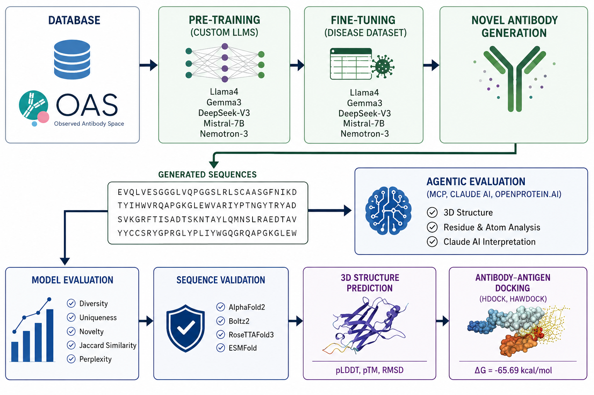

<div align="center">
  <h1>sdAbs-LLM: Generative Large Language Models for de novo Antibody Design and Agentic Evaluation</h1>
  
  [](https://opensource.org/licenses/MIT)
  [](https://www.python.org/)
  [](https://pytorch.org/)
  []()
</div>

<br/>

## 📖 Overview
Despite major advances in computational antibody engineering, systematic comparison of modern open-source LLM backbone families for antibody sequence generation remains scarce, particularly at compact model scales. **sdAbs-LLM** introduces five compact transformer variants inspired by prominent open-source LLM families (Llama-4, Gemma-3, DeepSeek-V3, Mistral 7B, and NVIDIA Nemotron-3). These models are customized and trained from scratch specifically for *de novo* VH single-domain antibody (sdAb) design. The pipeline also introduces a proof-of-concept agentic evaluation framework leveraging the Model Context Protocol (MCP) with Claude Sonnet 4.6 for automated structural profiling and candidate prioritization.

## ✨ 5 Significant Features
1. **Compact LLM Variants:** Introduction of five compact LLM-inspired models (Llama-4, Gemma-3, DeepSeek-V3, Mistral, Nemotron-3) trained from scratch to generate VH sdAb candidates rapidly (~8h/model on A100 80GB).
2. **Massive Pretraining:** Models are pretrained on 14.5 million biological sequences from the Observed Antibody Space (OAS) dataset, achieving uniformly high generative fidelity (diversity 0.507–0.516, novelty 0.925–0.977).
3. **Disease-Specific Fine-Tuning:** Tailored sequence generation for four major immunologically relevant disease targets: HIV, Ebola virus, HER2, and SARS-CoV-2.
4. **Rigorous Multi-Disease Validation:** Robust structural and biological validation through AlphaFold-2, Boltz-2, RoseTTAFold-2, ESMFold, and computational docking pipelines.
5. **Agentic AI Evaluation:** An advanced MCP + Claude AI integration pipeline that orchestrates multiple structural evaluation tools for dynamic, automated 3D profiling and prioritization.

## 🏗️ Architecture Overview



We adopted compact configurations inspired by state-of-the-art open-source LLM backbones. All variants share a compressed architecture scale to isolate and assess inductive biases within an antibody domain context:
* **Llama-4 (Compact)**
* **Gemma-3 (Compact)**
* **DeepSeek-V3 (Compact)**
* **Mistral 7B (Compact)**
* **NVIDIA Nemotron-3 (Compact)**

**Grid of Architectural Constraints:**
* **Layers:** 6
* **Hidden Dimensions:** 384
* **Attention Heads:** 4
* **Parameters:** ~2–10 Million
* **Sequence Length:** Up to 512 tokens (single-residue tokenization)

## 📊 Dataset
The models utilize comprehensive repertoire datasets to learn the underlying biological grammar of antibodies:
* **Pretraining:** 14.5 Million sequences from the **Observed Antibody Space (OAS)** for capturing VH single-domain general sequence semantics.
* **Fine-tuning (4 Diseases):**
  * **SARS-CoV-2:** 4,688 sequences
  * **Ebola virus:** 2,868 sequences
  * **HER2:** 22,778 sequences
  * **HIV:** 430 sequences

## 🔬 Case Studies
Our customized models have been successfully fine-tuned and tested on four prominent targets:
1. **Ebola virus:** Produced sequences with the strongest predicted binding free energy (ΔG = −65.60 kcal/mol).
2. **HIV:** Generated highly diverse sequence candidates (diversity up to 0.711) due to the challenging and complex nature of the target repertoire.
3. **HER2:** Demonstrated complex dataset dynamics, successfully avoiding mode collapse in models like DeepSeek-V3-Ab.
4. **SARS-CoV-2:** High sequence generation confidence, resulting in structurally stable, novel sequences targeting the viral envelope.

## 🚀 Inference Information
Inference generation uses our fixed-vocabulary tokenizer (BPE backend) recognizing 20 canonical amino acid residues. Generated leads are passed through our Agentic Evaluation Pipeline.

### Hugging Face Inference Example
You can generate sequences using our pre-trained models hosted on Hugging Face:

```python
import torch
from transformers import AutoTokenizer, AutoModelForCausalLM

# Load tokenizer and model
checkpoint_path = "Delower/Llama4-Ebola-Ab"
tokenizer = AutoTokenizer.from_pretrained(checkpoint_path)
model = AutoModelForCausalLM.from_pretrained(checkpoint_path)

device = "cuda" if torch.cuda.is_available() else "cpu"
model.to(device)
model.eval()

# Generate sequences
prompts = ["[BOS]"]
inputs = tokenizer(prompts, return_tensors="pt", padding=True).to(device)

with torch.no_grad():
    outputs = model.generate(
        input_ids=inputs["input_ids"],
        attention_mask=inputs["attention_mask"],
        max_new_tokens=170,
        temperature=1.0,
        do_sample=True,
    )

decoded = tokenizer.batch_decode(outputs, skip_special_tokens=True)
sequences = [seq.replace(" ", "") for seq in decoded]
print("Generated Sequences:\\n", sequences)
```

### Agentic Evaluation Pipeline
* Top 20 candidates (2% of generated output) structurally verified.
* Uses **AlphaFold-2**, **Boltz-2**, **RoseTTAFold-2**, and **ESMFold** to determine pLDDT scores and 3D folding accuracy.
* Further validated via rigid-body docking using **HDOCK** and **HawDOCK**.

### 🛠️ MCP Server Setup

The Agentic Evaluation framework leverages the Model Context Protocol (MCP) to integrate Claude Desktop (or other MCP-capable AI agents) with 3D folding and profiling tools. The MCP server is implemented in [mcp_server.py](file:///c:/Users/mhoss/Box/ACM_Antibody_Design_Project/Github-sdAbs-LLM/Scripts/mcp_server.py) and wraps the `openprotein` API.

#### 🔑 Credentials & Environment Configuration
1. **OpenProtein Credentials:** Obtain your credentials (username and password) from OpenProtein.
2. **Environment Variables:** Create a `.env` file in the root of the repository or in the `Scripts/` directory:
   ```env
   OP_USERNAME=your_openprotein_username
   OP_PASSWORD=your_openprotein_password
   ```

#### 📦 Installation in Conda Environment
Activate your Conda environment and install the required dependencies (including the `mcp` SDK):
```bash
conda activate antibody_dl
pip install mcp openprotein-python python-dotenv pandas biopython modlamp pfeature mhcflurry
```

#### 🖥️ Claude Desktop Integration
To allow Claude Desktop to interact with the OpenProtein MCP server:
1. Open your Claude Desktop configuration file:
   - **Windows:** `%APPDATA%\Claude\claude_desktop_config.json`
   - **macOS:** `~/Library/Application Support/Claude/claude_desktop_config.json`
2. Add the `openprotein-mcp` server to the `mcpServers` configuration:
   ```json
   {
     "mcpServers": {
       "openprotein-mcp": {
         "command": "conda",
         "args": [
           "run",
           "-n",
           "antibody_dl",
           "python",
           "C:/Users/mhoss/Box/ACM_Antibody_Design_Project/Github-sdAbs-LLM/Scripts/mcp_server.py"
         ],
         "env": {
           "OP_USERNAME": "your_openprotein_username",
           "OP_PASSWORD": "your_openprotein_password"
         }
      }
     }
   }
   ```
   *Note: Remember to replace `C:/Users/mhoss/Box/ACM_Antibody_Design_Project/Github-sdAbs-LLM/Scripts/mcp_server.py` with the absolute path of the script on your system.*

#### 🚀 Running Manually (Verification)
You can run the server manually in the command line for verification:
```bash
conda activate antibody_dl
python Scripts/mcp_server.py
```

## 📈 Result Table (Summary)
| Metric | Llama-4 | Gemma-3 | DeepSeek-V3 | Mistral | Nemotron-3 |
| :--- | :--- | :--- | :--- | :--- | :--- |
| **Mean pLDDT** | 92.82 | 93.85 | 93.69 | 93.85 | 93.07 |
| **Diversity** | ~0.507 | ~0.516 | ~0.512 | ~0.510 | ~0.509 |
| **Uniqueness** | 0.999 | 0.991 | 0.997 | 0.998 | 0.995 |
| **Novelty** | 0.977 | 0.925 | 0.930 | 0.977 | 0.955 |

*(Note: Above structural and metric outputs significantly outperform evaluated baseline models like IgLM and AbLang under similar parameter constraints).*

## 🔗 Upload & Citation Information
If you use this repository or its pre-trained models in your research, please consider citing our manuscript:

```bibtex
@article{Hossain2026sdAbsLLM,
  title={Generative Large Language Models For de novo Antibody Design and Agentic Evaluation},
  author={Hossain, Delower and Chen, Jake Y. and others},
  journal={TBD},
  year={2026}
}
```

**GitHub Repository:** [https://github.com/hossain013/sdAbs-LLM](https://github.com/hossain013/sdAbs-LLM)
